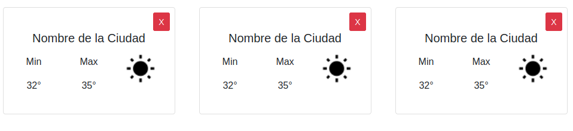
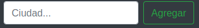

## Weather App

### Ejercicio

En este homework creamos una serie de Componentes de React:

#### Weather Card (`components/Card.js`)

Esta tarjeta muestra el nombre de una ciudad, con su temperatura máxima y mínima, y con una imagen que representa el estado del clima (soleado, nublado, etc..), además cuando el usuario hace click en la X de cerrar, se invoca una función que viene como props.

Cada componente Card recibe:
- **max**: Temperatura Máxima.
- **min**: Temperatura Mínima.
- **name**: Nombre de la ciudad.
- **img**: nombre de la imagen que se debe mostrar.
- **onClose**: recibe una función que se ejecuta cuando el usuario hace click en el botón de cerrar.

Todos estos datos llegan desde una API externa de clima (http://openweathermap.org)

#### Cards (`components/Cards.js`)

Este Componente renderiza muchos Componentes `Cards`. Recibe un arreglo de `ciudades` (con todos sus datos), y crea un componente `Card` por cada ciudad con sus propiedades correspondientes.

#### Barra de búsqueda (`components/SearchBar.js`)

Este componente se utiliza para busca ciudades sobre las cuales se desee ver el clima actual y ejecuta una función `onSearch` cuando se hace click en el botón `Agregar`

