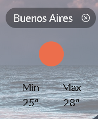
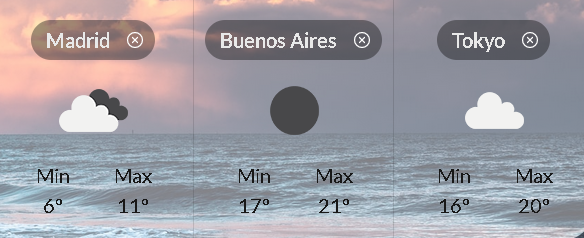
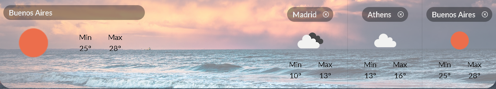
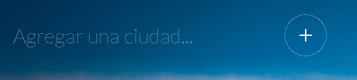

## Weather App

#### Durante el Bootcamp en Henry creamos una App del clima que permite ver el estado del tiempo hasta en 3 ciudades en tiempo real. El proyecto terminado luce así:

### Creamos una serie de Componentes de React:

#### Weather Card (`components/Card.js`)

Esta tarjeta muestra el nombre de una ciudad, con su temperatura máxima y mínima, y con una imagen que representa el estado del clima (soleado, nublado, etc..).

Cada componente Card recibe:
- **max**: Temperatura Máxima.
- **min**: Temperatura Mínima.
- **name**: Nombre de la ciudad.
- **img**: nombre de la imagen que se debe mostrar.
- **onClose**: recibe una función que se ejecuta cuando el usuario hace click en el botón de cerrar.

#### Todos estos datos llegan desde una API externa de clima (http://openweathermap.org)

Además, cuando el usuario hace click en la X de cerrar, muestra el detalle de esa ciudad en particular y al apretar el botón atrás, muestra todas las ciudades excepto la eliminada.

#### Cards (`components/Cards.js`)

Este Componente renderiza muchos Componentes `Cards`. Recibe un arreglo de `ciudades` (con todos sus datos), y crea un componente `Card` por cada ciudad con sus propiedades correspondientes.

También muestra de manera destacada sobre el lado izquierdo el `detalle de la última ciudad agregada`; en la siguiente imagen, los datos de la ciudad de Buenos Aires se ven en un mayor tamaño y separados del resto de las ciudades ubicadas sobre el lado derecho de la misma. 

#### Barra de búsqueda (`components/SearchBar.js`)

Este componente se utiliza para busca ciudades sobre las cuales se desee ver el clima actual y ejecuta una función `onSearch` cuando se hace click en el botón `Agregar`

`Me gustó muchísimo!...` hacer este proyecto - aprendí un montón sobre el funcionamiento de `React` y me encantó el estilo que le dimos utilizando `module.css`.

